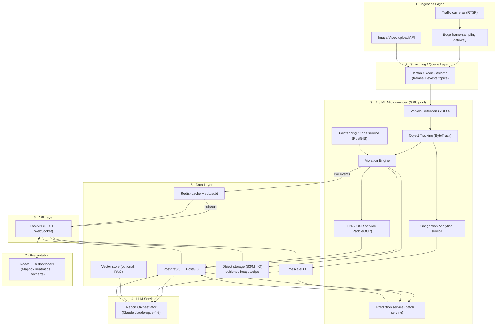
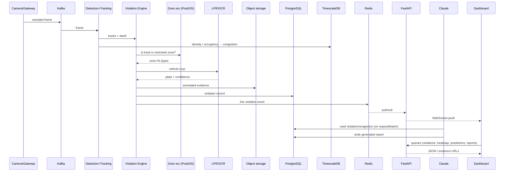
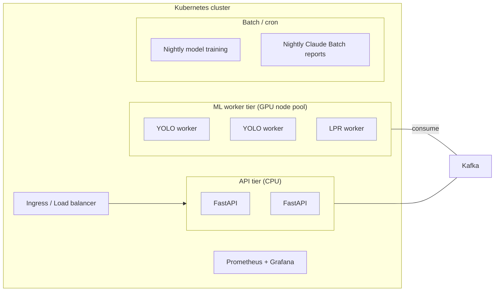
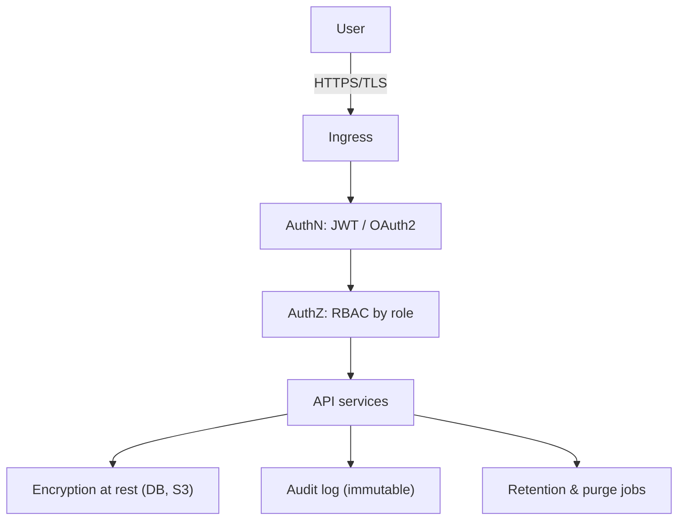

# 02 · High-Level Design (HLD)

← Prev: [01 Requirements](01-requirements-and-scope.md) · Next: [03 LLD](03-LLD-low-level-design.md)

This document describes the **system architecture** — the layers, the services, how data flows, and how the platform scales, stays secure, and is observed. Detailed module/DB/algorithm design lives in the [LLD](03-LLD-low-level-design.md).

---

## 1. Architectural Principles

1. **Queue-decoupled pipeline** — ingestion never blocks on inference; a message bus buffers frames/events and provides back-pressure (NFR-3/4/5).
2. **Stateless services, scalable workers** — API is stateless behind a load balancer; GPU ML workers scale independently on queue depth.
3. **Separation of concerns** — detection, tracking, LPR, congestion, prediction, and reporting are independent services with typed contracts.
4. **Geospatial-first data model** — PostGIS for zones/violations; TimescaleDB for time-series metrics.
5. **Human-in-the-loop** — AI proposes; an officer confirms before penal action (NFR-11).
6. **Privacy by design** — plate PII encrypted, access-controlled, retention-limited, audited (NFR-6/7).

---

## 2. Layered Component Architecture

### Layer responsibilities

| Layer | Responsibility |
| --- | --- |
| **1 Ingestion** | Pull RTSP streams; accept uploads; sample frames at a configurable FPS at the gateway to cap GPU load; publish frames to the bus. |
| **2 Streaming/Queue** | Durable buffer between ingest and inference; topics for `frames`, `detections`, `violations`, `congestion`; enables autoscaling and replay. |
| **3 ML microservices** | The CV/analytics brain — see §3. |
| **4 LLM service** | Turns structured violation/congestion data into human-readable reports & insights via Claude; optional RAG over historical reports. |
| **5 Data** | Relational+geo (PostGIS), time-series (TimescaleDB), blob evidence (S3/MinIO), hot state/realtime (Redis), optional vector store for LLM RAG. |
| **6 API** | FastAPI REST for CRUD/queries + WebSocket for live detections/congestion push. Enforces auth/RBAC. |
| **7 Presentation** | React/TS SPA: dashboards, maps/heatmaps, charts, evidence viewer, admin. |

---

## 3. ML Microservices (detail)

| Service | Input | Output | Notes |
| --- | --- | --- | --- |
| **Vehicle Detection** | Sampled frame | Bounding boxes + class + confidence | YOLO (v8/v11), GPU batch inference. |
| **Object Tracking** | Detections per frame | Track IDs + per-track trajectory/dwell | ByteTrack/DeepSORT; dwell time → stationary. |
| **Geofencing/Zone** | Detection geo + zone polygons | In-zone? zone type? | PostGIS `ST_Contains`; zones cached in Redis. |
| **Violation Engine** | Track (stationary) + zone hit | Violation event | Rule: dwell > threshold AND in restricted zone (time-aware for event zones). |
| **LPR/OCR** | Vehicle crop of a violation | Plate string + confidence | Plate localization → PaddleOCR → regex normalize → manual-review fallback. |
| **Congestion Analytics** | Detections + tracks per segment | Congestion score (0–100) + occupancy | Time-series to TimescaleDB. |
| **Prediction** | Historical + live aggregates | Hotspot probability per zone/time | Batch training (nightly) + online serving. |

> The Violation Engine is the convergence point: it consumes tracking output, queries the zone service, and on a confirmed rule match it (a) writes the violation row, (b) triggers LPR on the crop, (c) stores annotated evidence, and (d) emits a live event to Redis for the dashboard.

---

## 4. End-to-End Data Flow

---

## 5. Scalability & Deployment

- **Horizontal scaling**: API pods scale on CPU/RPS; **GPU workers scale on Kafka consumer lag** (queue depth) → more streams = more workers, no API change.
- **Frame sampling** at the gateway caps per-stream GPU cost (e.g. 2–5 FPS instead of 30).
- **Batch economics**: nightly model retraining and nightly **Claude Batch API** report generation run as cron jobs off the hot path (NFR-9).
- **Multi-camera fan-out**: each camera = a partition key; ordering preserved per camera, parallelism across cameras.
- **Stateless API + externalized state** (DB/Redis/S3) → pods are disposable; rolling deploys with zero downtime.

---

## 6. Security & Privacy (NFR-6/7/11)

- **AuthN**: JWT/OAuth2; short-lived access tokens + refresh.
- **AuthZ**: RBAC — Admin / Officer / Analyst / Viewer (matrix in [04](04-page-structure-and-ui.md#role-based-access-matrix)).
- **PII handling**: plate text encrypted at rest; access to plate/evidence is role-gated and **audit-logged**.
- **Retention**: configurable retention windows; automated purge of expired evidence/plates.
- **Transport**: TLS everywhere; signed, expiring URLs for evidence blobs.
- **Chain of custody**: evidence is immutable; every view/status-change is recorded for legal admissibility.
- **LLM data boundary**: only the minimum structured fields needed are sent to Claude; no raw PII beyond what a report requires; prompt/templates reviewed.

---

## 7. Observability (NFR-8)

| Concern | Tooling | Examples |
| --- | --- | --- |
| Metrics | Prometheus + Grafana | queue lag, inference latency, FPS/stream, API p95, LLM tokens/cost |
| Logging | Centralized (e.g. Loki/ELK) | structured request + pipeline logs with correlation IDs |
| Tracing | OpenTelemetry | frame → detection → violation → report trace |
| ML monitoring | Custom + Grafana | detection confidence drift, OCR accuracy, prediction error vs actuals |
| Alerting | Alertmanager | worker lag, GPU saturation, error-rate spikes, model-drift |

---

## 8. Technology Choices & Rationale

| Concern | Choice | Alternatives considered | Why this one |
| --- | --- | --- | --- |
| Backend | FastAPI | Flask, Django, Node | Async, OpenAPI-native, lives in the Python ML ecosystem |
| Detection | YOLO v8/v11 | Detectron2, RT-DETR | Best real-time accuracy/speed, mature tooling |
| Tracking | ByteTrack | DeepSORT, OC-SORT | Strong MOT accuracy, lightweight |
| OCR | PaddleOCR | EasyOCR, Tesseract | Better on varied/Indian plates; localization + recognition |
| LLM | Claude `claude-opus-4-8` | other LLMs | Strong reasoning + **vision** (verify evidence) + 1M context + **Batch API** (cost) + structured outputs |
| Queue | Kafka | Redis Streams, RabbitMQ | Durable, partitioned, replayable at scale (Redis Streams acceptable for smaller pilots) |
| Geo DB | PostgreSQL + PostGIS | MongoDB+geo | Mature spatial queries, transactional integrity |
| Time-series | TimescaleDB | InfluxDB | SQL + PostGIS in same engine family; continuous aggregates |
| Blob | S3 / MinIO | filesystem | Durable, scalable, signed URLs (MinIO for on-prem) |
| Realtime | Redis pub/sub | Kafka direct to UI | Low-latency push to WebSocket fan-out |
| Frontend | React + TS | Vue, Angular | Ecosystem (Mapbox, Recharts), strong typing |
| Maps | Mapbox GL / Leaflet | Google Maps | Rich heatmap/vector layers, self-hostable tiles |
| Infra | Docker + K8s | VMs, serverless | GPU node pools + autoscaling + rolling deploys |

See deeper, code-level design in [03-LLD-low-level-design.md](03-LLD-low-level-design.md) and the contracts in [06-api-specification.md](06-api-specification.md).
