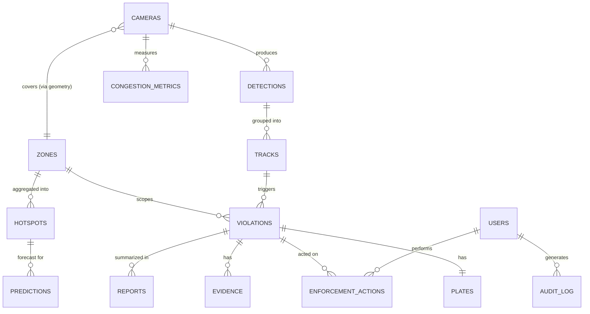
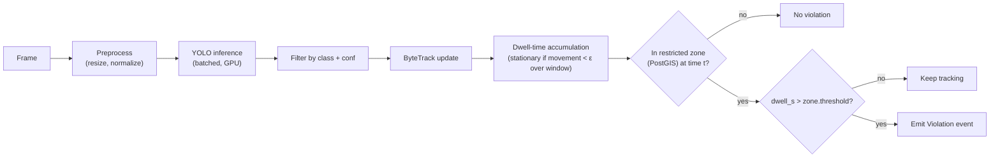
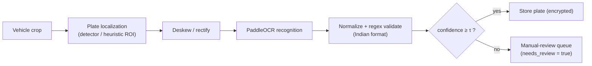
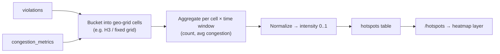
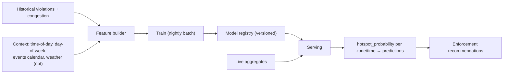
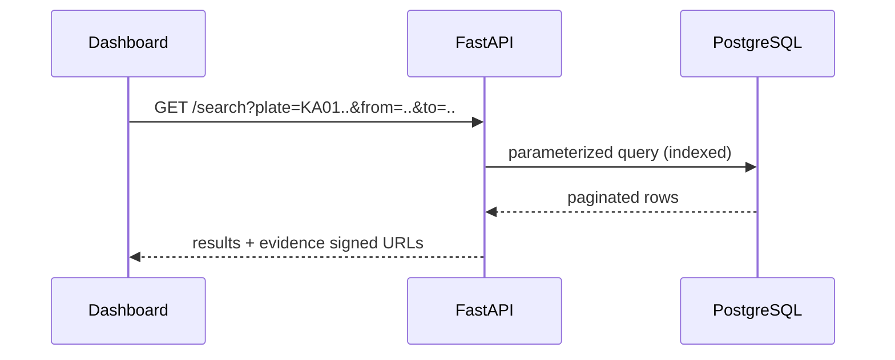
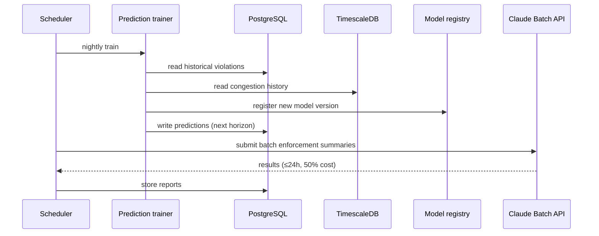

# 03 · Low-Level Design (LLD)

← Prev: [02 HLD](02-HLD-high-level-design.md) · Next: [04 Page Structure](04-page-structure-and-ui.md)

Detailed design: module internals, database schema, the CV/LPR/congestion/prediction algorithms, and the Claude LLM reporting design. Contracts (endpoints) are in [06-api-specification.md](06-api-specification.md).

---

## 1. Module Breakdown

Each microservice is a Python package with a clear contract. Suggested internal shape (illustrative, not prescriptive):

| Service | Key classes / functions | Inputs → Outputs | Config |
| --- | --- | --- | --- |
| `ingestion` | `RTSPReader`, `FrameSampler`, `FramePublisher` | RTSP/upload → `FrameMessage` on Kafka | sample FPS, camera registry |
| `detection` | `YoloDetector.infer(frame)`, `DetectionBatcher` | `FrameMessage` → `Detection[]` | model path, conf/iou thresholds, batch size |
| `tracking` | `ByteTracker.update(dets)`, `DwellTracker` | `Detection[]` → `Track[]` with dwell | max-age, dwell window |
| `zone` | `ZoneIndex.query(point, t)` | point+time → `ZoneHit?` | PostGIS, Redis cache TTL |
| `violation` | `ViolationEngine.evaluate(track, zoneHit)` | track+zone → `Violation?` | dwell threshold per zone type |
| `lpr` | `PlateLocalizer`, `PaddleOcrReader`, `PlateNormalizer` | crop → `Plate{text,conf}` | conf threshold, regex set |
| `congestion` | `CongestionScorer.score(frameStats)` | stats → `CongestionMetric` | weights, segment map |
| `prediction` | `FeatureBuilder`, `HotspotModel.train/predict` | aggregates → `Prediction[]` | model type, horizon |
| `reporting` | `ReportOrchestrator`, `ClaudeClient`, `PromptBuilder` | structured data → `Report` | model id, effort, batch on/off |
| `api` | FastAPI routers, deps, RBAC | HTTP/WS ↔ services | JWT secret, CORS |

All inter-service messages are JSON (or Avro/Protobuf on Kafka) with a shared `correlation_id` for tracing.

---

## 2. Database Schema

### 2.1 Entity-Relationship diagram



### 2.2 Table definitions (core)

> `geometry`/`geography` columns use **PostGIS**; `congestion_metrics` is a **TimescaleDB hypertable**.

| Table | Key columns | Notes |
| --- | --- | --- |
| **cameras** | `id`, `name`, `rtsp_url`, `location geography(Point)`, `calibration jsonb`, `status` | camera registry + geo |
| **zones** | `id`, `name`, `zone_type`, `geom geometry(Polygon)`, `active_window jsonb`, `dwell_threshold_s` | `zone_type` ∈ {no_parking, intersection, metro, commercial, event}; `active_window` for time-bounded event zones |
| **detections** | `id`, `camera_id`, `ts`, `bbox jsonb`, `vehicle_class`, `confidence`, `geo geography(Point)` | raw detections (retention-limited) |
| **tracks** | `id`, `camera_id`, `track_ref`, `first_ts`, `last_ts`, `dwell_s`, `is_stationary`, `path geometry(LineString)` | aggregated per tracked object |
| **violations** | `id`, `track_id`, `zone_id`, `camera_id`, `ts`, `vehicle_class`, `status`, `congestion_contribution`, `severity` | `status` ∈ {pending, confirmed, dismissed, ticketed}; central record |
| **plates** | `id`, `violation_id`, `plate_text`(enc), `confidence`, `needs_review`, `reviewed_by` | PII encrypted; low-conf → review |
| **evidence** | `id`, `violation_id`, `s3_key`, `kind`, `annotated`, `sha256`, `created_at` | immutable evidence refs (`kind` ∈ image/clip) |
| **congestion_metrics** | `ts`, `camera_id`, `segment_id`, `vehicle_count`, `occupancy_ratio`, `flow_rate`, `congestion_score` | **hypertable**; continuous aggregates for trends |
| **hotspots** | `id`, `geo_cell`, `zone_id`, `window`, `violation_count`, `avg_congestion`, `intensity` | geo-grid aggregation for heatmaps |
| **predictions** | `id`, `zone_id`/`geo_cell`, `horizon_start`, `horizon_end`, `hotspot_probability`, `model_version` | forecast outputs |
| **reports** | `id`, `type`, `scope jsonb`, `content`, `model`, `tokens`, `generated_at`, `source_refs jsonb` | `type` ∈ {violation, enforcement_summary, decision_support}; `source_refs` grounds the report |
| **enforcement_actions** | `id`, `violation_id`, `user_id`, `action`, `notes`, `ts` | officer actions (confirm/dismiss/ticket) |
| **users** | `id`, `email`, `role`, `password_hash`, `status` | `role` ∈ {admin, officer, analyst, viewer} |
| **audit_log** | `id`, `user_id`, `action`, `entity`, `entity_id`, `meta jsonb`, `ts` | append-only, immutable |

Indexes: spatial GIST on `zones.geom`/`cameras.location`; btree on `violations(ts)`, `violations(status)`, `plates(plate_text)`; Timescale time+space partitioning on `congestion_metrics`.

---

## 3. CV Pipeline Internals (FR-1)



**Key rules & parameters**
- **Stationary test**: centroid displacement below ε (px, calibrated to meters) sustained over a sliding window.
- **Dwell threshold**: per `zone_type` (e.g. shorter for intersections than commercial zones); from `zones.dwell_threshold_s`.
- **Event zones**: rule active only within `active_window`.
- **Confidence gating**: detection conf ≥ threshold; below → ignored or flagged.
- **De-duplication**: one open violation per `(track, zone)` until resolved (vehicle leaves / officer acts).

---

## 4. LPR / OCR Pipeline (FR-2)



- **Indian plate regex** (illustrative): `^[A-Z]{2}[ -]?[0-9]{1,2}[ -]?[A-Z]{1,3}[ -]?[0-9]{4}$`; post-processing maps common OCR confusions (`O↔0`, `I↔1`, `B↔8`).
- **Confidence**: combine plate-detector score × OCR char-confidence.
- **Fallback**: low-confidence → `plates.needs_review=true`, surfaced in the dashboard for an officer to correct; correction is audit-logged.

---

## 5. Congestion Scoring Algorithm (FR-4)

For a camera/segment at time *t*:

```
density_norm    = clamp(vehicle_count / capacity_count, 0, 1)
occupancy_ratio = occupied_road_area / drivable_road_area      # from masks/bbox coverage
lane_blockage   = blocked_lane_width / total_lane_width        # parked-vehicle intrusion
flow_penalty    = 1 - clamp(flow_rate / free_flow_rate, 0, 1)  # slow flow ⇒ higher penalty

congestion_score = 100 * (
      w_d * density_norm
    + w_o * occupancy_ratio
    + w_l * lane_blockage
    + w_f * flow_penalty
)                                # weights w_* sum to 1, tuned on labeled data
```

- **Illegal-parking contribution** (FR-4.3): recompute the score with the parked vehicle's footprint removed; `congestion_contribution = score_with − score_without`. Stored on the `violations` row.
- Weights `w_*` are configuration, calibrated against labeled congestion ground truth (see [07](07-data-and-ml-models.md)); MAE is the eval metric.
- Written to `congestion_metrics` (hypertable); **continuous aggregates** roll up to minute/hour for fast trend queries.

---

## 6. Hotspot Heatmap Generation (FR-5)



- Geo-grid: H3 hex cells (or fixed lat/lng grid) per configurable resolution.
- `intensity = normalize(α·violation_count + β·avg_congestion)` per cell per window.
- Time slider replays windows; filters (zone type, class, severity) re-query aggregates.

---

## 7. Prediction Model Design (FR-6)



- **Features**: time-of-day, day-of-week, holiday/event flags, recent violation density per zone, recent congestion trend, (optional) weather.
- **Candidate models**: gradient boosting (XGBoost/LightGBM) for tabular per-zone/time; LSTM/Temporal models or Prophet for sequence forecasting. Choose per evaluation ([07](07-data-and-ml-models.md)).
- **Output**: `hotspot_probability ∈ [0,1]` per zone/time-bucket for the forecast horizon → `predictions`.
- **Recommendations**: rank zones by predicted probability × expected congestion impact; emit "deploy at zone X during window Y" with rationale (LLM phrases this in the report, §8).

---

## 8. LLM Reporting Design (FR-7) — Claude

**Model:** `claude-opus-4-8` (Anthropic). Adaptive thinking + `effort` for quality/cost; **structured outputs** for machine-parseable fields; **Batch API** for nightly bulk runs; **prompt caching** for the shared system prompt; **vision** to optionally let Claude sanity-check the annotated evidence image. (See [07-data-and-ml-models.md](07-data-and-ml-models.md) for exact API parameters and cost notes.)

### 8.1 Report types & structured input

| Report type | Triggered | Structured input (grounding) |
| --- | --- | --- |
| **Violation report** | per confirmed violation / batch | violation row + plate + zone + congestion_contribution + evidence ref |
| **Enforcement summary** | daily/weekly cron (Batch API) | aggregates: counts by zone/type, top hotspots, trends, actions taken |
| **Decision-support insight** | analyst on-demand / scheduled | predictions + hotspots + historical comparison |

### 8.2 Prompt structure

- **System prompt** (stable, cached): role = "traffic-enforcement reporting assistant"; rules = *only use provided data, never invent plates/times/locations; cite `source_refs`; be concise and factual*.
- **User content**: a JSON block of the structured input + the requested report type.
- **Output**: `output_config.format` JSON schema → `{ summary, details[], recommended_actions[], source_refs[] }`, plus a rendered markdown body.

### 8.3 Grounding & guardrails (FR-7.4)

- Every factual claim must map to a field in the structured input; `source_refs` lists the violation/metric IDs used.
- Temperature-style variance is not used; reports are deterministic-leaning and auditable.
- No raw PII beyond the plate already in the violation context; redact on export per role.

### 8.4 Optional RAG

For decision-support, retrieve prior reports/notes from the **vector store** to give Claude historical context (e.g. "this hotspot recurs every match day"). Retrieval is over report embeddings keyed by zone/time.

---

## 9. Key Sequence Diagrams

### 9.1 Live violation → report

```mermaid
sequenceDiagram
    participant Vio as Violation Engine
    participant DB as PostgreSQL
    participant Rt as Redis
    participant Api as FastAPI
    participant Ui as Dashboard
    participant Off as Officer
    participant Llm as Claude

    Vio->>DB: insert violation (status=pending)
    Vio->>Rt: publish live event
    Rt-->>Api: pub/sub
    Api-->>Ui: WebSocket push (new violation)
    Off->>Api: open violation detail
    Api-->>Off: evidence + plate + congestion impact
    Off->>Api: confirm violation
    Api->>DB: status=confirmed + enforcement_action
    Api->>Llm: generate violation report (structured input)
    Llm-->>Api: structured report + markdown
    Api->>DB: store report
    Api-->>Off: report ready
```

### 9.2 Dashboard search query



### 9.3 Nightly prediction + summary batch



---

## 10. Error Handling & Resilience

- **Queue back-pressure**: if GPU workers lag, frames buffer in Kafka; gateway can drop to a lower sample FPS (graceful degradation, NFR-5).
- **Idempotency**: violation creation keyed by `(track, zone, open)` to avoid duplicates on retries.
- **LLM failures**: Claude API errors are retried with backoff (SDK default); on persistent failure the report is queued for retry, violation data is unaffected.
- **OCR uncertainty**: never blocks a violation — plate can be `needs_review` while the violation proceeds to officer confirmation.
- **Schema/versioning**: model outputs carry `model_version`; reports carry `model` + token usage for cost/audit.
