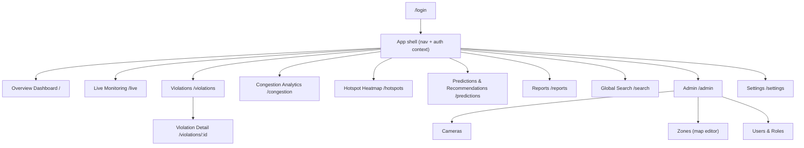

# 04 · Page Structure & UI

← Prev: [03 LLD](03-LLD-low-level-design.md) · Next: [05 Implementation Plan](05-implementation-plan.md)

The dashboard is a **React + TypeScript** SPA. This document defines the information architecture, every page's purpose/components/data sources, the role-based access matrix, and component/state conventions.

---

## 1. Information Architecture



Persistent **left nav** + **top bar** (global search, alerts/notifications, user menu). Content area renders the active route.

---

## 2. Page-by-Page Specification

### 2.1 Login / Auth — `/login`
- **Purpose**: authenticate; establish session + role.
- **Components**: login form, SSO button (optional), error states.
- **Data**: `POST /auth/login` → JWT; refresh handling.

### 2.2 Overview Dashboard — `/`
- **Purpose**: at-a-glance state of the city (FR-8.1).
- **Components**:
  - KPI cards: **Total violations (today / 7d)**, **Active hotspots**, **Live congestion index**, **Enforcement actions today**.
  - Mini trend sparkline (violations over time).
  - Top 5 hotspots list (link → Hotspot map).
  - Recent violations feed (link → Violations).
- **Data**: `GET /dashboard/summary`, `GET /hotspots?top=5`, `GET /violations?limit=10`.

```
+------------------------------------------------------------------+
|  Overview                              [date range ▾]  [refresh]  |
+------------------+------------------+------------------+----------+
| Violations Today | Active Hotspots  | Congestion Index | Actions  |
|       128        |        7         |       64 / 100   |    41    |
+------------------+------------------+------------------+----------+
| Violations trend (sparkline)        | Top 5 hotspots             |
|  ____/\__/\___                       | 1. Indiranagar  92         |
|                                      | 2. MG Road      88   ...   |
+--------------------------------------+----------------------------+
| Recent violations (table preview → Violations)                   |
+------------------------------------------------------------------+
```

### 2.3 Live Monitoring — `/live`
- **Purpose**: real-time camera feeds + live detections (FR-8.5).
- **Components**: camera grid (selectable), live overlay of detections/violations via **WebSocket**, live congestion badge per feed, "new violation" toasts.
- **Data**: `GET /cameras`, WebSocket `/ws/live` (detections + violation events).

### 2.4 Violations — `/violations`
- **Purpose**: searchable/filterable record of violations (FR-8.2).
- **Components**: filter bar (date, zone, zone type, vehicle class, status, plate), data table (evidence thumbnail, plate, zone, time, congestion impact, status), pagination, bulk actions (officer), CSV export.
- **Data**: `GET /violations` (filters + pagination), `GET /evidence/:id` (signed URLs).

```
+------------------------------------------------------------------+
| Violations   [date][zone▾][type▾][class▾][status▾][plate____][⏷] |
+------+-----------+----------+-----------+----------+------+--------+
| img  | Plate     | Zone     | Time      | Congest. | Stat | ⋮      |
+------+-----------+----------+-----------+----------+------+--------+
| 🖼   | KA01AB1234| MG Road  | 10:42     |   +18    | pend | view   |
| 🖼   | KA05CD5678| Metro-3  | 10:39     |   +9     | conf | view   |
+------+-----------+----------+-----------+----------+------+--------+
|                                            ◀ 1 2 3 … ▶  [Export]  |
+------------------------------------------------------------------+
```

### 2.5 Violation Detail — `/violations/:id`
- **Purpose**: full evidence + decision surface (FR-3, FR-7.1).
- **Components**: large **annotated evidence image** (bbox + plate + timestamp + location overlay), plate panel (with confidence; **edit if `needs_review`**), zone/location map snippet, **congestion impact** widget, **LLM-generated report** panel (generate/regenerate/export), action buttons (**confirm / dismiss / issue ticket**), audit trail.
- **Data**: `GET /violations/:id`, `GET /reports?violation_id=`, `POST /reports` (generate), `POST /violations/:id/actions`.

```
+-------------------------------+----------------------------------+
| Annotated evidence            | Plate: KA01AB1234  conf 0.94     |
|  [ image with bbox + overlay ]| Zone: MG Road (no-parking)       |
|                               | Time: 2026-06-16 10:42 IST       |
|                               | Congestion impact: +18 (0–100)   |
+-------------------------------+----------------------------------+
| LLM Report  [Generate][Export PDF]                               |
|  "A two-wheeler was parked in a no-parking zone on MG Road for   |
|   6m20s, contributing an estimated +18 to local congestion…"     |
+------------------------------------------------------------------+
| [ Confirm ]  [ Dismiss ]  [ Issue ticket ]      Audit trail ▾    |
+------------------------------------------------------------------+
```

### 2.6 Congestion Analytics — `/congestion`
- **Purpose**: trends & road-occupancy analysis (FR-8.3, FR-4).
- **Components**: time-series charts (congestion score per camera/segment), occupancy breakdown, compare zones, date-range + granularity controls.
- **Data**: `GET /congestion` (time-series, continuous aggregates).

### 2.7 Hotspot Heatmap — `/hotspots`
- **Purpose**: spatial concentration of violations/congestion (FR-5).
- **Components**: full-screen **Mapbox** map with heat layer, **time slider** to replay windows, filters (zone type, class, severity), click a cell → drill into violations there.
- **Data**: `GET /hotspots` (heat cells per window + filters).

### 2.8 Predictions & Recommendations — `/predictions`
- **Purpose**: forecast hotspots + recommended enforcement (FR-6).
- **Components**: forecast map/table (probability per zone for upcoming windows), ranked **recommendations** ("deploy at X during Y") with rationale, horizon selector.
- **Data**: `GET /predictions`, recommendations derived server-side (LLM-phrased rationale).

### 2.9 Reports — `/reports`
- **Purpose**: browse/generate LLM reports (FR-7.2/7.3/7.5).
- **Components**: report list (type, scope, date), report viewer (markdown), generate enforcement summary / decision-support, **export PDF/CSV**.
- **Data**: `GET /reports`, `POST /reports`, `GET /reports/:id`.

### 2.10 Global Search — `/search`
- **Purpose**: cross-record lookup (FR-8.2).
- **Components**: query bar (plate / location / date range), unified results (violations, plates, reports), quick links to detail.
- **Data**: `GET /search`.

### 2.11 Admin — `/admin`
- **Cameras**: register/edit cameras (RTSP, geolocation, calibration), status.
- **Zones (map editor)**: draw/edit geofence polygons on a map, set `zone_type`, dwell threshold, `active_window` for event zones.
- **Users & Roles**: manage users, assign roles.
- **Data**: `GET/POST /cameras`, `GET/POST /zones`, `GET/POST /users` (admin only).

### 2.12 Settings — `/settings`
- **Purpose**: profile, notifications, thresholds, data-retention config, theme.
- **Data**: `GET/PATCH /settings`.

---

## 3. Role-Based Access Matrix

| Page / action | Admin | Officer | Analyst | Viewer |
| --- | :--: | :--: | :--: | :--: |
| Overview | ✅ | ✅ | ✅ | ✅ |
| Live Monitoring | ✅ | ✅ | ✅ | 👁 |
| Violations (view) | ✅ | ✅ | ✅ | 👁 |
| Violation **actions** (confirm/dismiss/ticket) | ✅ | ✅ | ❌ | ❌ |
| Edit plate (`needs_review`) | ✅ | ✅ | ❌ | ❌ |
| Congestion Analytics | ✅ | 👁 | ✅ | 👁 |
| Hotspot Heatmap | ✅ | ✅ | ✅ | 👁 |
| Predictions & Recommendations | ✅ | 👁 | ✅ | 👁 |
| Reports (view) | ✅ | ✅ | ✅ | 👁 |
| Reports (generate) | ✅ | ✅ | ✅ | ❌ |
| Global Search | ✅ | ✅ | ✅ | 👁 |
| Admin (cameras/zones/users) | ✅ | ❌ | ❌ | ❌ |
| Settings (own profile) | ✅ | ✅ | ✅ | ✅ |

✅ full · 👁 read-only · ❌ no access. Enforced server-side (API RBAC) and reflected client-side (hide/disable controls).

---

## 4. Component Library & State

| Concern | Approach |
| --- | --- |
| **Map / heatmap** | Mapbox GL JS (or Leaflet) wrapper component; layers for cameras, zones, heatmap, predictions |
| **Charts** | Recharts (trends, bars) / D3 for custom viz |
| **Data tables** | TanStack Table (sorting, pagination, column filters) |
| **Evidence viewer** | Zoomable image component with overlay annotations |
| **Forms** | React Hook Form + zod validation (mirrors API schemas) |
| **Server state** | TanStack Query (caching, refetch, pagination) |
| **Realtime** | WebSocket client → query cache updates / toasts |
| **Auth state** | Context provider holding JWT + role; route guards |
| **Styling** | Tailwind CSS + a component kit (e.g. shadcn/ui); light/dark theme |
| **Routing** | React Router; route-level code splitting |

**Conventions**: API types generated from the OpenAPI spec ([06](06-api-specification.md)) so the frontend and backend never drift; all list endpoints paginate; all destructive actions confirm; all evidence URLs are short-lived signed URLs.
