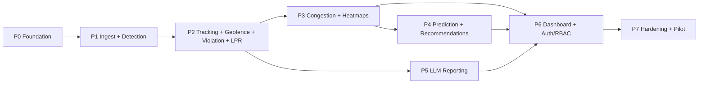
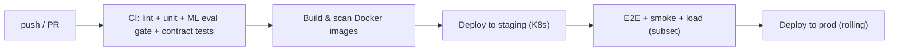

# 05 · Implementation Plan

← Prev: [04 Page Structure](04-page-structure-and-ui.md) · Next: [06 API Spec](06-api-specification.md)

How the system gets built: phased roadmap with exit criteria, the eventual code repository layout, testing strategy, CI/CD & deployment, risks, and the verification/traceability checklist.

---

## 1. Phased Roadmap

Each phase has a goal and **exit criteria** (done = criteria met & tested). Phases are sequenced by dependency, not fixed calendar dates.



### Phase 0 — Foundation
- Repo scaffolding (mono-repo), Docker Compose for local dev, base infra-as-code, CI pipeline, secrets management, DB migrations framework.
- **Exit**: `docker compose up` brings up Postgres+PostGIS, TimescaleDB, Redis, MinIO, Kafka, an empty FastAPI, and an empty React app; CI runs lint+test on every push.

### Phase 1 — Ingestion + Vehicle Detection (FR-1.1/1.2)
- RTSP reader + frame-sampling gateway; upload endpoint; Kafka topics; YOLO detection worker; persist `detections`; evidence storage wiring.
- **Exit**: a sample video/RTSP feed produces detections visible via an API query; annotated frames stored in MinIO.

### Phase 2 — Tracking + Geofencing + Violation Engine + LPR (FR-1.3–1.6, FR-2, FR-3)
- ByteTrack + dwell tracking; PostGIS zone service + admin zone CRUD; Violation Engine rules; LPR/OCR service + manual-review queue; annotated evidence + audit log.
- **Exit**: a vehicle parked in a defined no-parking zone beyond threshold creates a `violation` with plate (or `needs_review`), annotated evidence, and an audit entry.

### Phase 3 — Congestion Analytics + Heatmaps (FR-4, FR-5)
- Congestion scorer → TimescaleDB hypertable + continuous aggregates; geo-grid hotspot aggregation; heatmap API.
- **Exit**: congestion score time-series queryable; `/hotspots` returns heat cells; illegal-parking congestion contribution stored on violations.

### Phase 4 — Prediction + Recommendations (FR-6)
- Feature builder; nightly training job; model registry; serving; `predictions` table; recommendation ranking.
- **Exit**: a trained model writes next-horizon hotspot probabilities; `/predictions` returns forecasts with recommendations.

### Phase 5 — LLM Reporting (FR-7)
- Claude client (`claude-opus-4-8`), prompt builder, structured-output schema, per-violation report generation, nightly Batch summaries, optional RAG.
- **Exit**: confirming a violation produces a grounded report with `source_refs`; nightly enforcement summary generated via Batch API; reports exportable.

### Phase 6 — Dashboard + Auth/RBAC (FR-8)
- All 12 pages ([04](04-page-structure-and-ui.md)); auth + RBAC; WebSocket live updates; maps/charts/tables; admin map editor.
- **Exit**: each persona can complete its core workflow end-to-end through the UI; RBAC matrix enforced.

### Phase 7 — Hardening & Pilot
- Load/perf testing to target stream count; security review; observability dashboards & alerts; data-retention/purge jobs; deployment to staging→prod; pilot rollout.
- **Exit**: meets NFR targets (latency, throughput, availability) under load test; security review passed; pilot live with monitoring.

---

## 2. Repository Layout (eventual code)

```
repo/
├── docs/                      # this planning package
├── services/
│   ├── ingestion/             # RTSP reader, frame sampler, publisher
│   ├── detection/             # YOLO worker
│   ├── tracking/              # ByteTrack + dwell
│   ├── zone/                  # PostGIS geofencing
│   ├── violation/             # violation engine
│   ├── lpr/                   # plate localization + PaddleOCR
│   ├── congestion/            # scoring + timeseries writer
│   ├── prediction/            # training + serving
│   ├── reporting/             # Claude orchestrator
│   └── api/                   # FastAPI (REST + WebSocket, RBAC)
├── ml/
│   ├── models/                # model configs, weights refs
│   ├── training/              # training pipelines, eval
│   └── registry/              # model versioning
├── shared/
│   ├── schemas/               # pydantic + event schemas (single source of truth)
│   └── db/                    # migrations, PostGIS/Timescale setup
├── frontend/                  # React + TS dashboard
├── infra/
│   ├── docker/                # Dockerfiles, compose
│   ├── k8s/                   # manifests / Helm charts
│   └── ci/                    # pipeline configs
└── tests/                     # cross-service integration + e2e
```

Contracts (`shared/schemas`) generate the OpenAPI spec and the frontend's TS types so backend/frontend never drift.

---

## 3. Testing Strategy

| Level | Scope | Tooling |
| --- | --- | --- |
| **Unit** | scoring math, regex normalization, violation rules, prompt builder | pytest, vitest |
| **ML evaluation** | detection mAP, OCR accuracy, congestion MAE, prediction precision/recall on a held-out set; regression gate in CI | eval scripts + fixtures |
| **Integration** | service↔DB↔queue paths (detection→violation→LPR→evidence) | pytest + ephemeral Docker deps |
| **Contract** | API responses match OpenAPI; frontend types compile against schema | schemathesis / generated clients |
| **E2E** | persona workflows through the UI (login→violation→confirm→report) | Playwright |
| **Load/perf** | N concurrent streams, queue lag, API p95 under target RPS | k6 / locust + synthetic streams |
| **Security** | authz tests, evidence access control, dependency scan | OWASP checks, SCA |

LLM-specific checks: golden-set prompts asserting reports stay grounded (claims map to `source_refs`, no fabricated plates/times); token/cost budget assertions.

---

## 4. CI/CD & Deployment



- **Environments**: dev (compose) → staging (K8s) → prod (K8s).
- **Images**: per-service Docker images, vulnerability-scanned; GPU workers on GPU node pools.
- **Orchestration**: Kubernetes manifests/Helm; HPA on API (CPU/RPS) and on workers (Kafka lag).
- **Model versioning**: every trained model registered with a version; serving pins a version; rollback supported.
- **Config & secrets**: env-scoped config; secrets in a manager (never in images); Anthropic API key injected at runtime.
- **Migrations**: run as a pre-deploy job; backward-compatible schema changes.

---

## 5. Risks & Mitigations

| Risk | Impact | Mitigation |
| --- | --- | --- |
| OCR accuracy on Indian plates (fonts, dirt, angle, night) | Wrong/empty plates | Plate-specific fine-tuning, deskew, confidence gating, **manual-review** fallback, possible multi-frame voting |
| Night / weather / occlusion degrade detection | Missed/false violations | Day/night models or augmentation, confidence thresholds, multi-frame confirmation |
| False positives (loading, signals, brief stops) | Unfair enforcement | Dwell thresholds per zone type, time-aware event zones, **human-in-the-loop** confirmation (NFR-11) |
| GPU cost at scale | Budget overrun | Frame sampling, batched inference, autoscale on lag, right-size models |
| LLM cost / latency | Budget / UX | Prompt caching, **Batch API** for nightly runs, `effort` tuning, generate-on-confirm not per-detection |
| PII / legal exposure | Compliance breach | Encryption, RBAC, retention/purge, audit trail, chain-of-custody |
| Camera calibration drift | Wrong zone mapping | Periodic recalibration, admin zone editor, health checks |
| Model drift over time | Accuracy decay | Drift monitoring, scheduled retraining, eval gates |

---

## 6. Verification & Traceability

End-to-end verification at completion (also the acceptance gate):

1. **Requirement traceability** — confirm every FR-1…FR-8 maps to a built service, an API group ([06](06-api-specification.md)), a UI page ([04](04-page-structure-and-ui.md)), and a phase above (use the matrix in [01 §6](01-requirements-and-scope.md#6-requirement--design-traceability-overview)).
2. **Cross-doc consistency** — entity/table names in [03 §2](03-LLD-low-level-design.md#2-database-schema) match API resources in [06](06-api-specification.md) and the dashboard data sources in [04](04-page-structure-and-ui.md).
3. **NFR validation** — load test hits throughput/latency targets; security review covers NFR-6/7/11.
4. **ML eval gates** — detection/OCR/congestion/prediction metrics meet [07](07-data-and-ml-models.md) targets in CI.
5. **LLM grounding** — golden-set asserts reports cite `source_refs` and never fabricate.
6. **E2E persona walkthroughs** — each role completes its workflow through the deployed app.
